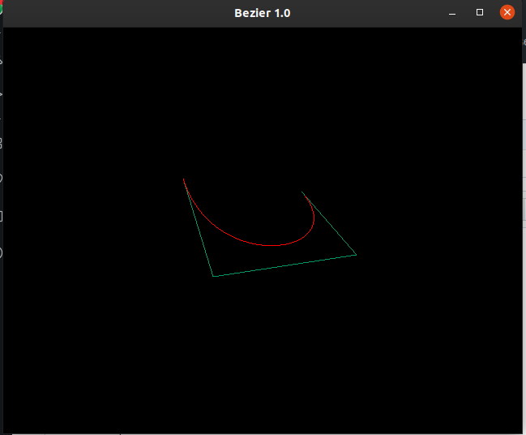
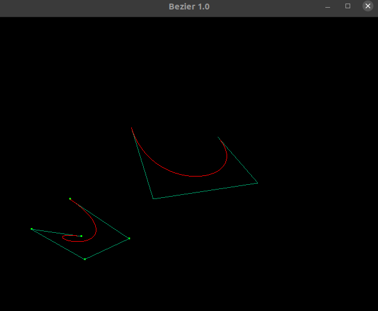
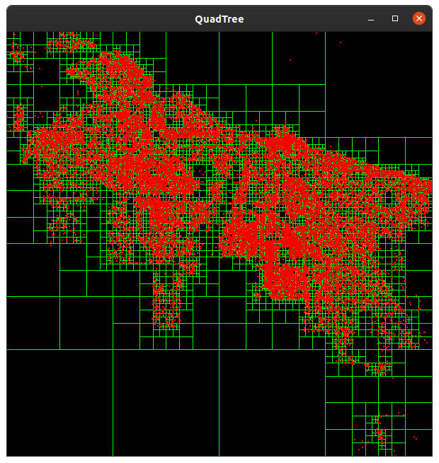

# Trabajo_Grafica_quadtree-Bezier


# 1 Curvas de Bezier
## Instrucciones para compilar


```
g++ bezier.cpp -o bezier -lglut -lGLU -lGL -fpermissive
```
Modo de Ejecución

```
./bezier
```


## Modo de Uso:
El programa le pedira el número de puntos, posteriormente se le pedirá hacer el mismo número de clicks sobre el
canvas para el gráfico de las curvas de bezier en tiempo real.
# Capturas:





# 2 Quadtree 
## Instrucciones para compilar
```
g++ glut.cpp -lX11 -lGL -lGLU -lglut -g -o glut
```
## Instrucciones para ejecutar
```
./glut #ElementosPorCuadrante
./glut 4
```
# Capturas:

